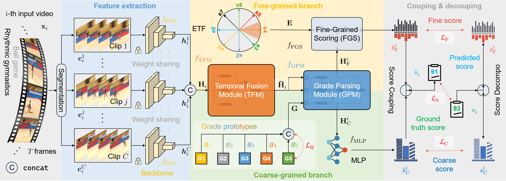

<div align="center">
  <div>
    <h1>
        CoFInAl: Enhancing Action Quality Assessment with Coarse-to-Fine Instruction Alignment
    </h1>
  </div>
  <div>
      Anonymous IJCAI 2024 Submission &emsp; Paper ID 291
  </div>
  <br/>
</div>


CoFInAl is the implementation for Action Quality Assessment (AQA) based on the paper "CoFInAl: Enhancing Action Quality Assessment with Coarse-to-Fine Instruction Alignment."

## Framework



CoFInAl addresses challenges related to domain shift and overfitting, common issues in AQA performance. To this end, CoFInAl strategically aligns AQA objectives with broader tasks through a coarse-to-fine classification strategy. Inspired by the two-step assessment process used by judges, CoFInAl first identifies a coarse grade and then discerns variations within each grade, mirroring the human judgment process.

## Datasets

Here are the instructions for obtaining the features and videos for the Rhythmic Gymnastics and Fis-V datasets used in our experiments:

For VST features:
- The VST features and label files of Rhythmic Gymnastics and Fis-V datasets can be download from the [GDLT](https://github.com/xuangch/CVPR22_GDLT) repository.

For I3D features:
- The I3D features and label files for both datasets will be released soon.

For Rhythmic Gymnastics videos:
- Download the videos from the [ACTION-NET](https://github.com/qinghuannn/ACTION-NET?tab=readme-ov-file) repository.

For Fis-V videos:
- Download the videos from the [MS_LSTM](https://github.com/chmxu/MS_LSTM) repository.

Please use the above public repositories to obtain the features and videos needed to reproduce our results. Let us know if you need any clarification or have trouble accessing the data.

After downloading the Rhythmic Gymnastics dataset features and videos from the referenced repositories, preprocess the data by using `rg_swinx.py`.

```bash
# Choose different head to extract features like load_model or load_model_I3d
data_path = 'Path/to/Video'

orig_save = 'Path/to/Save/swintx_orig_fps25_clip{}'.format(clip_len)
pool_save = 'Path/to/Save/swintx_avg_fps25_clip{}'.format(clip_len)

# Command
python rg_swintx.py
```

## Installation

To get started, you will need to first clone this project and then install the required dependencies.

#### Environments

\- RTX3090
\- CUDA: 11.1
\- Python: 3.8+
\- PyTorch: 1.10.1+cu111

### Basic packages

Install the required packages:

```bash
pip install -r requirements.txt
```

This will install all the required packages listed in the `requirements.txt` file.

### Training from scratch

Using the following command to train the model:

```bash
CUDA_VISIBLE_DEVICES={device ID} python main.py \
    --video-path {path}/swintx_avg_fps25_clip32 \
    --train-label-path {path}/train.txt \
    --test-label-path {path}/test.txt  \
    --model-name ${save_name} \
    --submodel-name ${sub_model_name} \
    --action-type Ball/{action type of RG or TES/PCS} \
    --lr 1e-2 --epoch 500 \
    --n_encoder 2 --n_decoder 4 --n_query 4 --alpha 0.5 --margin 1 --lr-decay cos --decay-rate 1e-2 --dropout 0.3\
    --loss_align 1 --activate_regular_restrictions 3
```

For all hyper-parameters, see `scripts/train_all.sh`.

## Testing

Using the following command to test the model:

```bash
CUDA_VISIBLE_DEVICES={device ID} python main.py --video-path {path}/swintx_avg_fps25_clip32 \
    --train-label-path {path}/train.txt \
    --test-label-path {path}/test.txt  \
    --n_decoder 2 --n_query 4 --dropout 0.3 --test \
    --model-name ${save_name} \
    --submodel-name ${sub_model_name} \
    --action-type Ball/{action type of RG or TES/PCS} \
    --ckpt {pkl file here}
```

For all hyper-parameters, see `scripts/test_all.sh`.

## Acknowledgements

If you have any specific questions or if there's anything else you'd like assistance with regarding the code, feel free to let me know. Thanks for your examination!
